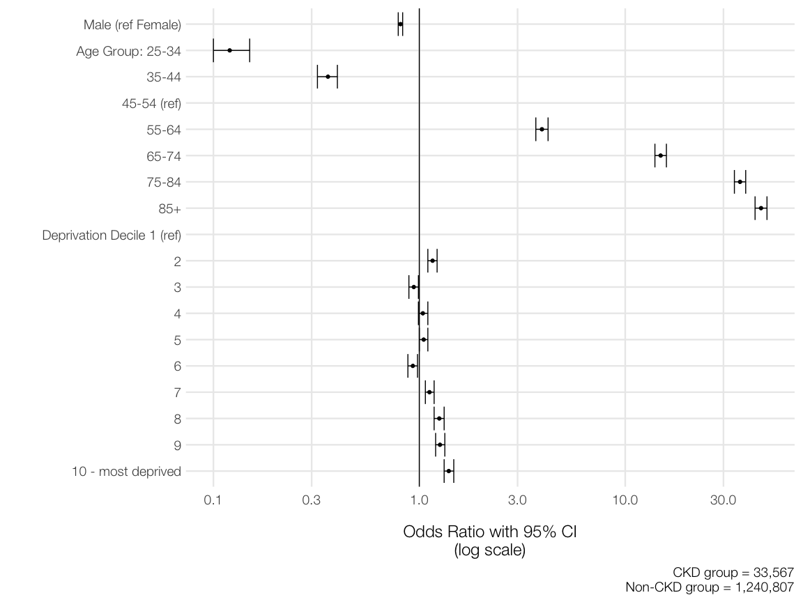
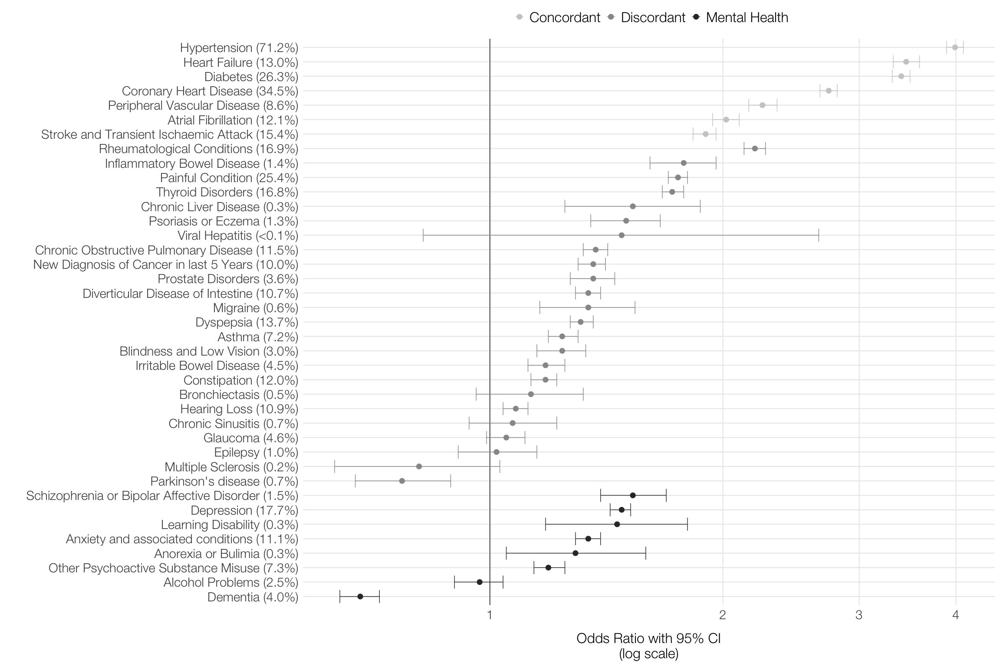
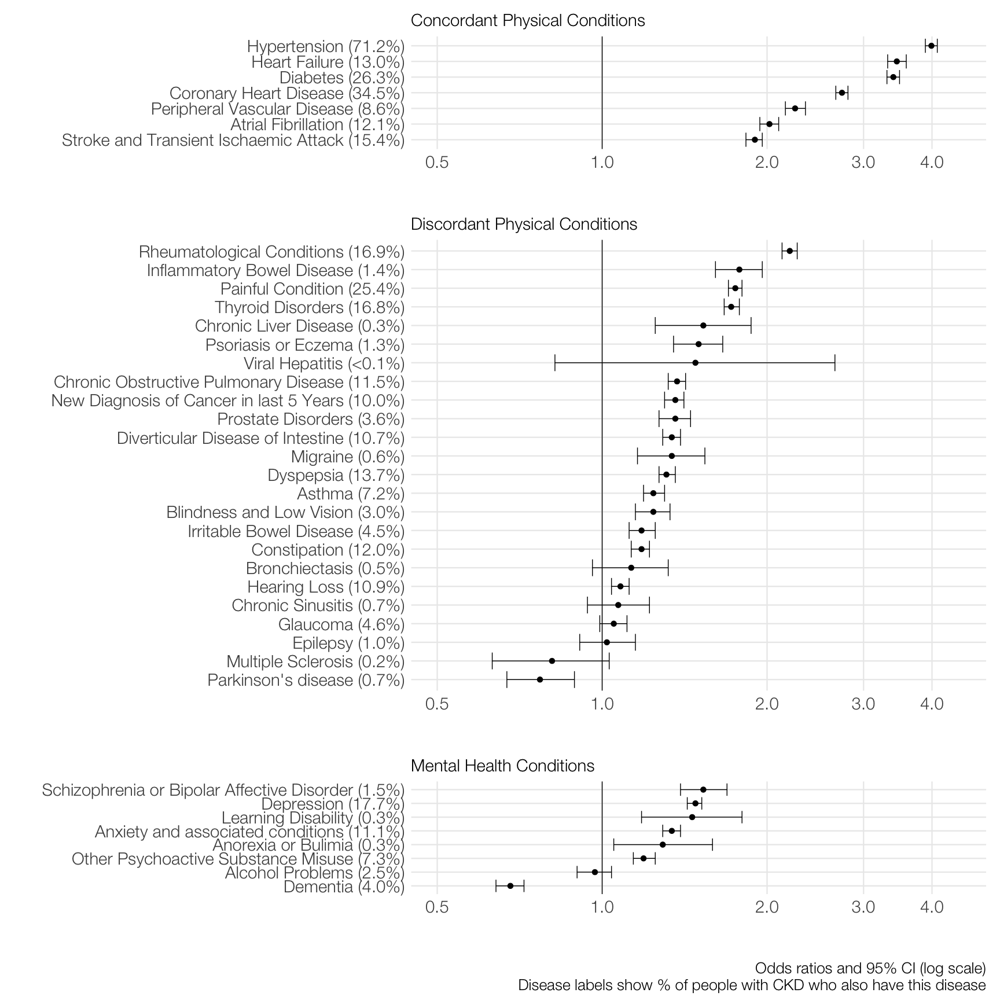

# Preamble

This document details the code used to analyse the data for the paper "Paper title in here" in the following sections. 

1. Preliminaries:          Load required packages and helper functions
2. Import and clean:       Import the data and clean ready for analysis  
3. Descriptive Statistics: First look at data description
4. Models:                 Fit models for designated variables on outcome  
5. Join:                   Combine baseline descriptive stats with main model output data
6. Outputs:                Tables and figures
7. Session Information:    Print all software used in session.


# Preliminaries

## Packages

Load in the required packages and set baseline plotting parameters. Non-CRAN packages marked with an *. Source for all provided in session information at the end of this document


```r
library(tidyverse)
library(finalfit)
library(phsmethods) #*
library(broom)
library(here)
library(janitor)
library(socviz)     
library(glue)
library(patchwork)

#Helper function to provide opposite of %in%
`%nin%` <- negate(`%in%`)
#Short cut for csv output with html tables
my_datatable <- function(x){
  DT::datatable(x, extensions = "Buttons", options = list(dom = "Bfrtip", 
                                                          buttons = c("csv")))
}

#Base plotting options
theme_set(theme_minimal(base_family = "Helvetica 45 Light", base_size = 18) +
            theme(panel.grid.minor = element_blank(),
                  axis.title.y = element_text(margin = margin(0, 20, 0, 0)),
                  axis.title.x = element_text(margin = margin(20, 0, 0, 0))))
```

# Import and clean data

The original data is provided as a SPSS `.sav` file. This can be loaded in but requires some cleaning. Code below is commented to identify what is being done on each command


```r
# Create new object called "spice"
spice <- 
  # read in from project data folder
  haven::read_sav(here("data/MM_LIVING_WELL_FINAL_DATASET_APRIL_2011.sav")) %>% 
  #Use janitor package to convert variable names to snake_case
  clean_names() %>% 
  #Drop unneeded variables
  select(-practice_id:-date_registered, -age_group:-age65,
         -carstairs_depcat:-qof_two_or_more, -filter) %>% 
  #Reorder variables so that Mental health variables listed first
  select(unique_patient_id:carstairs_decile, ckd, dementia, mental_alcohol, mental_psycho,
         learning_disability, anorexia, depression, schiz_bipolar, anxiety, everything()) %>%
  #Drop those under the age of 25
  filter(age >= 25) %>% 
  #Now count a) all morbidities, b)mental health morbs, c)physical health morbs
  #Easy to do by row counting relevant columns. These counts *exclude* CKD
  #And so are a count of CKD co-morbidity
  mutate(all_morbidities_count = rowSums(.[7:45]),
         mental_morbidities_count = rowSums(.[7:14]),
         physical_morbidities_count = rowSums(.[15:45]),
         all_morbidities = factor(all_morbidities_count),
         #Now create a factor version of each of the counts and specify labels
         all_morbidities = fct_collapse(all_morbidities,
                                        `0` = "0",
                                        `1` = "1",
                                        `2-3` = c("2", "3"),
                                        `4-6` = c("4", "5", "6"),
                                         other_level = ">=7"),
         physical_morbidities = factor(physical_morbidities_count),
         physical_morbidities = fct_collapse(physical_morbidities,
                                             `0` = "0",
                                             `1` = "1",
                                             `2-3` = c("2", "3"),
                                             `4-6` = c("4", "5", "6"),
                                             other_level = ">=7"),
         mental_morbidities = factor(mental_morbidities_count),
         mental_morbidities = fct_collapse(mental_morbidities,
                                           `0` = "0",
                                           `1` = "1",
                                           `2-3` = c("2", "3"),
                                           other_level = ">=4"),
         #Coerce sex variable to a factor and label
         sex = factor(sex, levels = c("0","1"),
                      labels = c("Female", "Male")),
         #Calculate age groups using phsmethods package and age_group()function
         age_group = age_group(age, from = 25, to = 85, by = 10),
         #Explicitly specify the factor levels for accuracy
         age_group = factor(age_group,
                            levels = c("25-34", "35-44", "45-54", "55-64", "65-74", "75-84",
                                       "85+")),
         #Factorise deprivation deciles
         carstairs_decile = factor(carstairs_decile),
         carstairs_decile = fct_inseq(carstairs_decile),
         #Important that main outcome variable is levelled as "failure" and
         #then "success" as per glm() models used later
         ckd = factor(ckd, levels = c(0, 1),
                      labels = c("No CKD", "CKD"))) %>%
  #All 39 other disease variables are now factorised
  mutate_at(vars(dementia:pain), ~factor(., levels = c("1", "0"),
                                     labels = c("Yes", "No"))) %>% 
  #rearrange variable order again
  select(unique_patient_id, sex, age, age_group, carstairs_score:ckd, all_morbidities,
         all_morbidities_count, physical_morbidities, physical_morbidities_count,
         mental_morbidities, mental_morbidities_count, everything())
```


# Descriptive stats


The `finalfit` package provides a simple way of printing a basic "Table 1" using the `summary_factorlist()` function. This won't be the final table 1 but used as the foundation. Additional cleaning added in order to allow this table to be joined to other results later.


```r
#Create vector of all variable names
spice_names <- names(spice)
#Define dependent variable
dependent <- "ckd"
#Define explanatory variables by subsetting the spice_names vector to  exclude the ID and CKD #variables
explanatory <- c(spice_names[spice_names %nin% c("unique_patient_id", "ckd")])

#Create the table
tab_1 <- 
  spice %>% 
  summary_factorlist(dependent, explanatory, add_col_totals = TRUE,
                     include_col_totals_percent = TRUE) %>% 
  #Coerce back to tidy object
  as_tibble() %>% 
  #Drop negative levels for diseases
  filter(levels %nin% "No") %>% 
  #Repeat label names in each group - this will enable joining to other tables later
  mutate(label = na_if(label, ""),
         label = zoo::na.locf(label))

tab_1
```

<div data-pagedtable="false">
  <script data-pagedtable-source type="application/json">
{"columns":[{"label":["label"],"name":[1],"type":["chr"],"align":["left"]},{"label":["levels"],"name":[2],"type":["chr"],"align":["left"]},{"label":["No CKD"],"name":[3],"type":["chr"],"align":["left"]},{"label":["CKD"],"name":[4],"type":["chr"],"align":["left"]}],"data":[{"1":"Total N (%)","2":"","3":"1240807 (97.4)","4":"33567 (2.6)"},{"1":"sex","2":"Female","3":"630127 (50.8)","4":"21342 (63.6)"},{"1":"sex","2":"Male","3":"610680 (49.2)","4":"12225 (36.4)"},{"1":"age","2":"Mean (SD)","3":"50.6 (16.2)","4":"74.9 (10.9)"},{"1":"age_group","2":"25-34","3":"229477 (18.5)","4":"117 (0.3)"},{"1":"age_group","2":"35-44","3":"278929 (22.5)","4":"420 (1.3)"},{"1":"age_group","2":"45-54","3":"253110 (20.4)","4":"1054 (3.1)"},{"1":"age_group","2":"55-64","3":"216168 (17.4)","4":"3536 (10.5)"},{"1":"age_group","2":"65-74","3":"146356 (11.8)","4":"9136 (27.2)"},{"1":"age_group","2":"75-84","3":"86223 (6.9)","4":"13238 (39.4)"},{"1":"age_group","2":"85+","3":"30544 (2.5)","4":"6066 (18.1)"},{"1":"carstairs_score","2":"Mean (SD)","3":"-0.2 (3.3)","4":"-0.1 (3.3)"},{"1":"carstairs_decile","2":"1","3":"116316 (9.4)","4":"3032 (9.0)"},{"1":"carstairs_decile","2":"2","3":"123215 (9.9)","4":"3470 (10.3)"},{"1":"carstairs_decile","2":"3","3":"120684 (9.7)","4":"3197 (9.5)"},{"1":"carstairs_decile","2":"4","3":"147848 (11.9)","4":"4048 (12.1)"},{"1":"carstairs_decile","2":"5","3":"142850 (11.5)","4":"3816 (11.4)"},{"1":"carstairs_decile","2":"6","3":"140072 (11.3)","4":"3213 (9.6)"},{"1":"carstairs_decile","2":"7","3":"130990 (10.6)","4":"3436 (10.2)"},{"1":"carstairs_decile","2":"8","3":"104384 (8.4)","4":"3086 (9.2)"},{"1":"carstairs_decile","2":"9","3":"113568 (9.2)","4":"3453 (10.3)"},{"1":"carstairs_decile","2":"10","3":"100880 (8.1)","4":"2816 (8.4)"},{"1":"all_morbidities","2":"0","3":"598194 (48.2)","4":"614 (1.8)"},{"1":"all_morbidities","2":"1","3":"278807 (22.5)","4":"3553 (10.6)"},{"1":"all_morbidities","2":"2-3","3":"248971 (20.1)","4":"12472 (37.2)"},{"1":"all_morbidities","2":"4-6","3":"99779 (8.0)","4":"13000 (38.7)"},{"1":"all_morbidities","2":">=7","3":"15056 (1.2)","4":"3928 (11.7)"},{"1":"all_morbidities_count","2":"Mean (SD)","3":"1.2 (1.6)","4":"3.8 (2.2)"},{"1":"physical_morbidities","2":"0","3":"669088 (53.9)","4":"801 (2.4)"},{"1":"physical_morbidities","2":"1","3":"275611 (22.2)","4":"4356 (13.0)"},{"1":"physical_morbidities","2":"2-3","3":"220654 (17.8)","4":"14130 (42.1)"},{"1":"physical_morbidities","2":"4-6","3":"69280 (5.6)","4":"12070 (36.0)"},{"1":"physical_morbidities","2":">=7","3":"6174 (0.5)","4":"2210 (6.6)"},{"1":"physical_morbidities_count","2":"Mean (SD)","3":"0.9 (1.4)","4":"3.4 (1.9)"},{"1":"mental_morbidities","2":"0","3":"1022283 (82.4)","4":"22980 (68.5)"},{"1":"mental_morbidities","2":"1","3":"159527 (12.9)","4":"7016 (20.9)"},{"1":"mental_morbidities","2":"2-3","3":"57091 (4.6)","4":"3464 (10.3)"},{"1":"mental_morbidities","2":">=4","3":"1906 (0.2)","4":"107 (0.3)"},{"1":"mental_morbidities_count","2":"Mean (SD)","3":"0.2 (0.6)","4":"0.4 (0.8)"},{"1":"dementia","2":"Yes","3":"10339 (0.8)","4":"1346 (4.0)"},{"1":"mental_alcohol","2":"Yes","3":"39764 (3.2)","4":"844 (2.5)"},{"1":"mental_psycho","2":"Yes","3":"38109 (3.1)","4":"2459 (7.3)"},{"1":"learning_disability","2":"Yes","3":"4346 (0.4)","4":"94 (0.3)"},{"1":"anorexia","2":"Yes","3":"4698 (0.4)","4":"107 (0.3)"},{"1":"depression","2":"Yes","3":"132317 (10.7)","4":"5950 (17.7)"},{"1":"schiz_bipolar","2":"Yes","3":"11664 (0.9)","4":"498 (1.5)"},{"1":"anxiety","2":"Yes","3":"50423 (4.1)","4":"3734 (11.1)"},{"1":"chd","2":"Yes","3":"69990 (5.6)","4":"11571 (34.5)"},{"1":"active_asthma","2":"Yes","3":"73886 (6.0)","4":"2422 (7.2)"},{"1":"atrial_fib","2":"Yes","3":"19945 (1.6)","4":"4049 (12.1)"},{"1":"epilepsy","2":"Yes","3":"11238 (0.9)","4":"325 (1.0)"},{"1":"any_cancer_last5yrs","2":"Yes","3":"39716 (3.2)","4":"3359 (10.0)"},{"1":"thyroid_disorders","2":"Yes","3":"65632 (5.3)","4":"5635 (16.8)"},{"1":"diabetes","2":"Yes","3":"65006 (5.2)","4":"8833 (26.3)"},{"1":"parkinsons","2":"Yes","3":"2517 (0.2)","4":"226 (0.7)"},{"1":"ms","2":"Yes","3":"3761 (0.3)","4":"67 (0.2)"},{"1":"tia_stroke","2":"Yes","3":"31354 (2.5)","4":"5169 (15.4)"},{"1":"blindness","2":"Yes","3":"7061 (0.6)","4":"992 (3.0)"},{"1":"glaucoma","2":"Yes","3":"14381 (1.2)","4":"1529 (4.6)"},{"1":"hearing_loss","2":"Yes","3":"48383 (3.9)","4":"3662 (10.9)"},{"1":"hypertension","2":"Yes","3":"210474 (17.0)","4":"23887 (71.2)"},{"1":"heart_failure","2":"Yes","3":"14528 (1.2)","4":"4363 (13.0)"},{"1":"pvd","2":"Yes","3":"20063 (1.6)","4":"2883 (8.6)"},{"1":"sinusitis","2":"Yes","3":"8706 (0.7)","4":"246 (0.7)"},{"1":"bronchitis","2":"Yes","3":"48120 (3.9)","4":"3846 (11.5)"},{"1":"bronchiectasis","2":"Yes","3":"2601 (0.2)","4":"181 (0.5)"},{"1":"crohns","2":"Yes","3":"8947 (0.7)","4":"480 (1.4)"},{"1":"diverticular","2":"Yes","3":"30254 (2.4)","4":"3591 (10.7)"},{"1":"rheu_arthritis","2":"Yes","3":"51699 (4.2)","4":"5661 (16.9)"},{"1":"prostate","2":"Yes","3":"14009 (1.1)","4":"1223 (3.6)"},{"1":"viral_hepatitis","2":"Yes","3":"1126 (0.1)","4":"12 (0.0)"},{"1":"liver_disease","2":"Yes","3":"2510 (0.2)","4":"104 (0.3)"},{"1":"psor_ecz","2":"Yes","3":"9233 (0.7)","4":"450 (1.3)"},{"1":"ibs","2":"Yes","3":"48995 (3.9)","4":"1523 (4.5)"},{"1":"migraine","2":"Yes","3":"8814 (0.7)","4":"205 (0.6)"},{"1":"dyspepsia","2":"Yes","3":"74077 (6.0)","4":"4598 (13.7)"},{"1":"laxatives_constipation","2":"Yes","3":"32112 (2.6)","4":"4014 (12.0)"},{"1":"pain","2":"Yes","3":"116667 (9.4)","4":"8521 (25.4)"}],"options":{"columns":{"min":{},"max":[10]},"rows":{"min":[10],"max":[10]},"pages":{}}}
  </script>
</div>


# Models

Logistic regression models are used with presence of CKD (Yes/No) as the outcome variable. We fit unadjusted models for all variables of interest (age group, sex, deprivation decile, morbidity groups, and presence of each of the other 39 diseases in the dataset), and models adjusted for age (continuous), sex, and deprivation score (continuous). 

A total of 92 models are fitted. Adjusted models for Age, Sex, and deprivation are adjusted only for the two other demographic groups e.g. Sex is adjusted for age and deprivation.

In order to complete this efficiently and collate results tidily, a data frame containing each of the independent variable names is created below...


```r
model_tab <- 
  tibble(label = spice_names[spice_names %nin% c("unique_patient_id", "ckd")])
model_tab
```

<div data-pagedtable="false">
  <script data-pagedtable-source type="application/json">
{"columns":[{"label":["label"],"name":[1],"type":["chr"],"align":["left"]}],"data":[{"1":"sex"},{"1":"age"},{"1":"age_group"},{"1":"carstairs_score"},{"1":"carstairs_decile"},{"1":"all_morbidities"},{"1":"all_morbidities_count"},{"1":"physical_morbidities"},{"1":"physical_morbidities_count"},{"1":"mental_morbidities"},{"1":"mental_morbidities_count"},{"1":"dementia"},{"1":"mental_alcohol"},{"1":"mental_psycho"},{"1":"learning_disability"},{"1":"anorexia"},{"1":"depression"},{"1":"schiz_bipolar"},{"1":"anxiety"},{"1":"chd"},{"1":"active_asthma"},{"1":"atrial_fib"},{"1":"epilepsy"},{"1":"any_cancer_last5yrs"},{"1":"thyroid_disorders"},{"1":"diabetes"},{"1":"parkinsons"},{"1":"ms"},{"1":"tia_stroke"},{"1":"blindness"},{"1":"glaucoma"},{"1":"hearing_loss"},{"1":"hypertension"},{"1":"heart_failure"},{"1":"pvd"},{"1":"sinusitis"},{"1":"bronchitis"},{"1":"bronchiectasis"},{"1":"crohns"},{"1":"diverticular"},{"1":"rheu_arthritis"},{"1":"prostate"},{"1":"viral_hepatitis"},{"1":"liver_disease"},{"1":"psor_ecz"},{"1":"ibs"},{"1":"migraine"},{"1":"dyspepsia"},{"1":"laxatives_constipation"},{"1":"pain"}],"options":{"columns":{"min":{},"max":[10]},"rows":{"min":[10],"max":[10]},"pages":{}}}
  </script>
</div>

Two functions are now defined, one for fitting a univariate logistic regression model with the argument `x` used to denote the independent variable. The second is a helper function to save typing repetition when extracting model results. 


```r
model_uni <- function(x){
  glm(as.formula(paste("ckd ~",x)), family = binomial, data = spice)
}


mm_tidy <- function(df, mod_type = tidy_mod_multi){
  mod_type <- enquo(mod_type)
  
  df %>%
    #drop unneeded columns from model output
    select(label, !!mod_type) %>% 
    #unnest the model results
    unnest(!!mod_type) %>% 
    #calculate odds-ratio and 95% CIs
    mutate(or = exp(estimate),
           conf_low = exp(estimate - 1.96*std.error),
           conf_hi = exp(estimate + 1.96*std.error)) %>%
    #tidy column order
    select(label, levels = term, or, conf_low, conf_hi, everything()) %>% 
    #round to 2 significant figures
    round_df(dig = 2) -> x
  
  return(x)
    
}
```


## Sex

The first models are fitted with sex as independent variable. As the adjusted model cannot include sex a separate adjusted model function is created for sex. Both models are then run with sex as independent variable and model objects appended as list columns to `model_tab`. The previously defined `mm_tidy()` function is then used to extract model results. Finally, the unadjusted and adjusted models results are joined together.


```r
#Define adjusted model for sex
sex_model_multi <- function(x){
  glm(as.formula(paste("ckd ~",x,"+ age + carstairs_score")), 
      family = binomial, data = spice)
}

#fit unadjusted and adjusted models, then extract results with broom::tidy()
#all results stored in new list columns
model_tab %>% 
  filter(label %in% "sex") %>% 
  mutate(model_uni = map(label, ~model_uni(.x)),
         model_multi = map(label, ~sex_model_multi(.x)),
         tidy_mod_uni = map(model_uni, tidy),
         tidy_mod_multi = map(model_multi, tidy)) -> sex_mod

#run the previously defined function to extract results and calculate
#ORs with CIs from adjusted model
sex_mod %>% 
  mm_tidy() %>% 
  #drop the reference level
  filter(levels %in% "sexMale") %>%
  #tidy labels and add prefix to indicated these are adjusted results
  mutate(levels = str_replace(levels,"sex", "")) %>% 
  rename_at(vars(or:p.value), ~paste0("adj_", .)) -> sex_mod_multi

#repeat above but for the unadjusted model
sex_mod %>% 
  mm_tidy(., mod_type = tidy_mod_uni) %>% 
  filter(levels %in% "sexMale") %>% 
  mutate(levels = str_replace(levels,"sex", "")) %>% 
  rename_at(vars(or:p.value), ~paste0("unadj_", .)) -> sex_mod_uni

#Join adjusted and unadjusted results together
sex_mod_all <- left_join(sex_mod_uni, sex_mod_multi) 

#Drop intermediary objects from memory
rm(list = c("sex_mod", "sex_mod_multi", "sex_mod_uni"))
sex_mod_all
```

<div data-pagedtable="false">
  <script data-pagedtable-source type="application/json">
{"columns":[{"label":["label"],"name":[1],"type":["chr"],"align":["left"]},{"label":["levels"],"name":[2],"type":["chr"],"align":["left"]},{"label":["unadj_or"],"name":[3],"type":["dbl"],"align":["right"]},{"label":["unadj_conf_low"],"name":[4],"type":["dbl"],"align":["right"]},{"label":["unadj_conf_hi"],"name":[5],"type":["dbl"],"align":["right"]},{"label":["unadj_estimate"],"name":[6],"type":["dbl"],"align":["right"]},{"label":["unadj_std.error"],"name":[7],"type":["dbl"],"align":["right"]},{"label":["unadj_statistic"],"name":[8],"type":["dbl"],"align":["right"]},{"label":["unadj_p.value"],"name":[9],"type":["dbl"],"align":["right"]},{"label":["adj_or"],"name":[10],"type":["dbl"],"align":["right"]},{"label":["adj_conf_low"],"name":[11],"type":["dbl"],"align":["right"]},{"label":["adj_conf_hi"],"name":[12],"type":["dbl"],"align":["right"]},{"label":["adj_estimate"],"name":[13],"type":["dbl"],"align":["right"]},{"label":["adj_std.error"],"name":[14],"type":["dbl"],"align":["right"]},{"label":["adj_statistic"],"name":[15],"type":["dbl"],"align":["right"]},{"label":["adj_p.value"],"name":[16],"type":["dbl"],"align":["right"]}],"data":[{"1":"sex","2":"Male","3":"0.59","4":"0.58","5":"0.6","6":"-0.53","7":"0.01","8":"-45.79","9":"0","10":"0.81","11":"0.79","12":"0.83","13":"-0.21","14":"0.01","15":"-17.51","16":"0"}],"options":{"columns":{"min":{},"max":[10]},"rows":{"min":[10],"max":[10]},"pages":{}}}
  </script>
</div>


## Age

The above process for Sex is now repeated for Age groups. An important point here is that the reference group is changed to be 45-54 which includes the mean and median ages for all the observations in the data.  


```r
#Change reference group to 45-54
spice %<>%
  mutate(age_group = fct_relevel(age_group, "45-54"))

#Define function for adjusted model for age group
age_model_multi <- function(x){
  glm(as.formula(paste("ckd ~ ",x,"+ sex + carstairs_score")), family = binomial,  data = spice)
}

#Fit models and tidy
model_tab %>% 
  filter(label %in% "age_group") %>% 
  mutate(model_uni = map(label, ~model_uni(.x)),
         model_multi = map(label, ~age_model_multi(.x)),
         tidy_mod_uni = map(model_uni, tidy),
         tidy_mod_multi = map(model_multi, tidy)) -> age_mod

#Extract and tidy adjusted model results
age_mod %>% 
  mm_tidy() %>%  
  filter(levels %nin% c("(Intercept)", "sexMale", "carstairs_score")) %>% 
  mutate(levels = str_replace(levels, "age_group", "")) %>% 
  rename_at(vars(or:p.value), ~paste0("adj_", .)) -> age_mod_multi

#Extract and tidy unadjusted results
age_mod %>% 
  mm_tidy(., tidy_mod_uni) %>% 
  filter(levels %nin% c("(Intercept)", "sexMale", "carstairs_score")) %>% 
  mutate(levels = str_replace(levels, "age_group", "")) %>% 
  rename_at(vars(or:p.value), ~paste0("unadj_", .)) -> age_mod_uni

#Join age group models together
age_mod_all <- left_join(age_mod_uni, age_mod_multi) 

#Drop intermediary objects
rm(list = c("age_mod", "age_mod_multi", "age_mod_uni"))
age_mod_all
```

<div data-pagedtable="false">
  <script data-pagedtable-source type="application/json">
{"columns":[{"label":["label"],"name":[1],"type":["chr"],"align":["left"]},{"label":["levels"],"name":[2],"type":["chr"],"align":["left"]},{"label":["unadj_or"],"name":[3],"type":["dbl"],"align":["right"]},{"label":["unadj_conf_low"],"name":[4],"type":["dbl"],"align":["right"]},{"label":["unadj_conf_hi"],"name":[5],"type":["dbl"],"align":["right"]},{"label":["unadj_estimate"],"name":[6],"type":["dbl"],"align":["right"]},{"label":["unadj_std.error"],"name":[7],"type":["dbl"],"align":["right"]},{"label":["unadj_statistic"],"name":[8],"type":["dbl"],"align":["right"]},{"label":["unadj_p.value"],"name":[9],"type":["dbl"],"align":["right"]},{"label":["adj_or"],"name":[10],"type":["dbl"],"align":["right"]},{"label":["adj_conf_low"],"name":[11],"type":["dbl"],"align":["right"]},{"label":["adj_conf_hi"],"name":[12],"type":["dbl"],"align":["right"]},{"label":["adj_estimate"],"name":[13],"type":["dbl"],"align":["right"]},{"label":["adj_std.error"],"name":[14],"type":["dbl"],"align":["right"]},{"label":["adj_statistic"],"name":[15],"type":["dbl"],"align":["right"]},{"label":["adj_p.value"],"name":[16],"type":["dbl"],"align":["right"]}],"data":[{"1":"age_group","2":"25-34","3":"0.12","4":"0.10","5":"0.15","6":"-2.10","7":"0.10","8":"-21.54","9":"0","10":"0.12","11":"0.10","12":"0.15","13":"-2.11","14":"0.10","15":"-21.65","16":"0"},{"1":"age_group","2":"35-44","3":"0.36","4":"0.32","5":"0.40","6":"-1.02","7":"0.06","8":"-17.61","9":"0","10":"0.36","11":"0.32","12":"0.40","13":"-1.02","14":"0.06","15":"-17.65","16":"0"},{"1":"age_group","2":"55-64","3":"3.93","4":"3.67","5":"4.21","6":"1.37","7":"0.04","8":"38.85","9":"0","10":"3.94","11":"3.68","12":"4.22","13":"1.37","14":"0.04","15":"38.92","16":"0"},{"1":"age_group","2":"65-74","3":"14.99","4":"14.06","5":"15.98","6":"2.71","7":"0.03","8":"82.81","9":"0","10":"14.86","11":"13.94","12":"15.85","13":"2.70","14":"0.03","15":"82.53","16":"0"},{"1":"age_group","2":"75-84","3":"36.87","4":"34.61","5":"39.28","6":"3.61","7":"0.03","8":"111.87","9":"0","10":"36.12","11":"33.90","12":"38.47","13":"3.59","14":"0.03","15":"111.16","16":"0"},{"1":"age_group","2":"85+","3":"47.69","4":"44.62","5":"50.97","6":"3.86","7":"0.03","8":"113.95","9":"0","10":"45.67","11":"42.72","12":"48.81","13":"3.82","14":"0.03","15":"112.40","16":"0"}],"options":{"columns":{"min":{},"max":[10]},"rows":{"min":[10],"max":[10]},"pages":{}}}
  </script>
</div>


## Deprivation

The final bespoke set of models is for deprivation adjusting for sex and age (results not printed)


```r
#Define adjusted model for deprivation
dep_model_multi <- function(x){
  glm(as.formula(paste("ckd ~",x,"+ sex + age")),
      family = binomial,
      data = spice)
}

#Fit and tidy models
model_tab %>% 
  filter(label %in% "carstairs_decile") %>% 
  mutate(model_uni = map(label, ~model_uni(.x)),
         model_multi = map(label, ~dep_model_multi(.x)),
         tidy_mod_uni = map(model_uni, tidy),
         tidy_mod_multi = map(model_multi, tidy)) -> dep_mod

#Extract and tidy adjusted model results
dep_mod %>% 
  mm_tidy  %>% 
  filter(levels %nin% c("(Intercept)", "sexMale", "sexFemale", "age")) %>% 
  mutate(levels = str_replace(levels, "carstairs_decile", "")) %>% 
  rename_at(vars(or:p.value), ~paste0("adj_", .)) -> dep_mod_multi

#Extract and tidy unadjusted model results
dep_mod %>% 
  mm_tidy(., tidy_mod_uni) %>% 
  filter(levels %nin% c("(Intercept)", "sexMale", "sexFemale", "age")) %>% 
  mutate(levels = str_replace(levels, "carstairs_decile", "")) %>% 
  rename_at(vars(or:p.value), ~paste0("unadj_", .)) -> dep_mod_uni

#Join deprivation model results together
dep_mod_all <- left_join(dep_mod_uni, dep_mod_multi) 

#Drop intermediary objects from memory
rm(list = c("dep_mod", "dep_mod_multi", "dep_mod_uni"))
#results not printed
```


## All other models


The remaining 84 models can be run with one chunk of code as the adjusted model is the same for each variable of interest: all co-morbidity grouped count, all physical co-morbidity grouped count, all mental health co-morbidity grouped count, and each of the other 39 diseases. This chunk takes ~6mins to run with 1.7GHz Quad Core Intel i7 processor and 16GB LPDDR3 RAM (results not printed).


```r
#Define function for adjusted model
model_multi <- function(x){
  glm(as.formula(paste("ckd ~",x,"+ age + sex + carstairs_score")), family = binomial, 
      data = spice)
}

#Relevel all of the disease variables so "No" is reference
spice %<>% 
  mutate_at(vars(dementia:pain), ~fct_relevel(.x, "No"))

#Fit and tidy the models
model_tab %>% 
  filter(label %nin% c("unique_patient_id",  "age", "age_group", "sex", "carstairs_score",
                       "carstairs_decile", "ckd")) %>% 
  mutate(model_uni = map(label, ~model_uni(.x)),
         model_multi = map(label, ~model_multi(.x)),
         tidy_mod_uni = map(model_uni, tidy),
         tidy_mod_multi = map(model_multi, tidy)) -> other_mod

#Extract and tidy adjusted model results
other_mod %>% 
  mm_tidy() %>% 
  filter(levels %nin% c("(Intercept)", "sexMale", "carstairs_score", "age"))%>% 
  mutate(levels = str_replace(levels,"all_morbidities", ""),
         levels = str_replace(levels, "physical_morbidities", ""),
         levels = str_replace(levels, "mental_morbidities", ""),
         levels = str_replace(levels, "Yes", "")) %>% 
  rename_at(vars(or:p.value), ~paste0("adj_", .)) -> other_mod_multi

#Extract and tidy unadjusted model results
other_mod %>% 
  mm_tidy(., tidy_mod_uni) %>% 
  filter(levels %nin% c("(Intercept)", "sexMale", "carstairs_score", "age"))%>% 
  mutate(levels = str_replace(levels,"all_morbidities", ""),
         levels = str_replace(levels, "physical_morbidities", ""),
         levels = str_replace(levels, "mental_morbidities", ""),
         levels = str_replace(levels, "Yes", "")) %>% 
  rename_at(vars(or:p.value), ~paste0("unadj_", .)) -> other_mod_uni

#Join and tidy adjusted and unadjusted results
other_mod_all <- left_join(other_mod_uni, other_mod_multi) %>% 
  mutate(levels = case_when(
    levels %in% c("1", "2-3", "4-6", ">=7", ">=4") ~ levels,
    TRUE ~ "Yes"
  ))

#remove intermediary objects
rm(list = c("other_mod", "other_mod_multi", "other_mod_uni"))
```


## Join Descriptive and Model Tables

Here the results of the models are combined with base table created above in the Descriptive stats section. Odds ratio and associated results are added to rows for each variable with some tidying of labels. New variables are created that paste together results of OR with CIs for easier printing in final tables. P-values are only included in they are >0.05

This contains complete results and extra information suitable for supplementary material. Main paper table will be created below. All variables can be viewed by clicking the small `>` button on the top row of the table. 


```r
final_tab <- 
  #Combine model result tables
  bind_rows(sex_mod_all, age_mod_all, dep_mod_all, other_mod_all) %>% 
  #Join to base table
  left_join(tab_1, ., by = c("label", "levels")) %>% 
  #coerce non-sig p-value to NA
  mutate(unadj_p.value = if_else(unadj_p.value < 0.05, NA_real_, unadj_p.value),
         #Coerce p value column to character
         unadj_p.value = as.character(unadj_p.value),
         #Conditionally add label if p>0.05
         unadj_p.value = if_else(!is.na(unadj_p.value),
                                 paste0("p = ", unadj_p.value), unadj_p.value),
         #repeat for adjusted model p values
         adj_p.value = if_else(adj_p.value < 0.05, NA_real_, adj_p.value),
         adj_p.value = as.character(adj_p.value),
         adj_p.value = if_else(!is.na(adj_p.value), paste0("p = ", adj_p.value), 
                               adj_p.value),
         #Create result label column for unadjusted models
         unadj_label = 
           glue("{unadj_or} ({unadj_conf_low} to {unadj_conf_hi}) {unadj_p.value}", 
                .na = ""),
         #tidy blank space
         unadj_label = str_replace(unadj_label, "\\( to \\)", ""),
         #Repeat for unadjusted model
         adj_label = 
           glue("{adj_or} ({adj_conf_low} to {adj_conf_hi}) {adj_p.value}", .na = ""),
         adj_label = str_replace(adj_label, "\\( to \\)", ""),
         #Change main lables to title case
         label = snakecase::to_any_case(label, "title"),
         #Fix those that fall through the net!
         label = str_replace(label, "Chd", "Coronary Heart Disease"),
         label = str_replace(label, "Pvd", "Peripheral Vascular Disease"),
         label = str_replace(label, "Tia Stroke", 
                             "Stroke and Transient Ischaemic Attack"),
         label = str_replace(label, "Crohns", "Inflammatory Bowel Disease"),
         label = str_replace(label, "Pain", "Painful Condition"),
         label = str_replace(label, "Schiz Bipolar", 
                             "Schizophrenia or Bipolar Affective Disorder"),
         label = str_replace(label, "Liver Disease", "Chronic Liver Disease"),
         label = str_replace(label, "Psor Ecz", "Psoriasis or Eczema"),
         label = str_replace(label, "Bronchitis", 
                             "Chronic Obstructive Pulmonary Disease"),
         label = str_replace(label, "Any Cancer Last 5 Yrs", 
                             "New Diagnosis of Cancer in last 5 Years"),
         label = str_replace(label, "Prostate", "Prostate Disorders"),
         label = str_replace(label, "Anxiety", "Anxiety and associated conditions"),
         label = str_replace(label, "Diverticular", "Diverticular Disease of Intestine"),
         label = str_replace(label, "Dyspepsia", "Dyspepsia"),
         label = str_replace(label, "Anorexia", "Anorexia or Bulimia"),
         label = str_replace(label, "Active Asthma", "Asthma"),
         label = str_replace(label, "Blindness", "Blindness and Low Vision"),
         label = str_replace(label, "Mental Psycho",
                             "Other Psychoactive Substance Misuse"),
         label = str_replace(label, "Ibs", "Irritable Bowel Disease"),
         label = str_replace(label, "Laxatives Constipation", "Constipation"),
         label = str_replace(label, "Sinusitis", "Chronic Sinusitis"),
         label = str_replace(label, "Mental Alcohol", "Alcohol Problems"),
         label = str_replace(label, "Ms", "Multiple Sclerosis"),
         label = str_replace(label, "Parkinsons", "Parkinson's disease"),
         label = str_replace(label, "Rheu Arthritis", "Rheumatological Conditions"),
         label = str_replace(label, "Atrial Fib", "Atrial Fibrillation")) %>% 
  #Reorder columns
  select(label, levels, `No CKD`, CKD, unadj_label, adj_label, unadj_or:unadj_conf_hi, 
         unadj_p.value, adj_or:adj_conf_hi, adj_p.value, everything())
  
#Remove disease rows and reorder by adjusted OR
final_tab %>% 
  filter(levels == "Yes") %>% 
  arrange(-adj_or) -> ordered_morbs
#Drop diseases from main tab then rejoin with ordered rows
final_tab %<>% 
  filter(levels != "Yes") %>% 
  bind_rows(., ordered_morbs)
```

# Outputs

## Table 1  

Table 1 is a list of diseases that are concordant or discordant physical or mental health conditions. No code required..


## Table 2


Use the table created above but keep only Demographic variables and model label columns. Note: clicking the `CSV` button will automatically download this table as csv to your machine.


```r
final_tab %>% 
  filter(label %in% c("Total n", "Sex", "Age", "Age Group", "Carstairs Decile")) %>% 
  select(label, levels, `No CKD`, CKD, unadj_label, adj_label) %>% 
  rename(Variable = label,
         Value = levels,
         `Unadjusted OR (95% CI)` = unadj_label,
         `Adjusted OR (95% CI)` = adj_label) %>%  
  my_datatable(.)
```

<!--html_preserve--><div id="htmlwidget-f697bb9934a549473640" style="width:100%;height:auto;" class="datatables html-widget"></div>
<script type="application/json" data-for="htmlwidget-f697bb9934a549473640">{"x":{"filter":"none","extensions":["Buttons"],"data":[["1","2","3","4","5","6","7","8","9","10","11","12","13","14","15","16","17","18","19","20","21"],["Total n","Sex","Sex","Age","Age Group","Age Group","Age Group","Age Group","Age Group","Age Group","Age Group","Carstairs Decile","Carstairs Decile","Carstairs Decile","Carstairs Decile","Carstairs Decile","Carstairs Decile","Carstairs Decile","Carstairs Decile","Carstairs Decile","Carstairs Decile"],["","Female","Male","Mean (SD)","25-34","35-44","45-54","55-64","65-74","75-84","85+","1","2","3","4","5","6","7","8","9","10"],["1240807 (97.4)","630127 (50.8)","610680 (49.2)","50.6 (16.2)","229477 (18.5)","278929 (22.5)","253110 (20.4)","216168 (17.4)","146356 (11.8)","86223 (6.9)","30544 (2.5)","116316 (9.4)","123215 (9.9)","120684 (9.7)","147848 (11.9)","142850 (11.5)","140072 (11.3)","130990 (10.6)","104384 (8.4)","113568 (9.2)","100880 (8.1)"],["33567 (2.6)","21342 (63.6)","12225 (36.4)","74.9 (10.9)","117 (0.3)","420 (1.3)","1054 (3.1)","3536 (10.5)","9136 (27.2)","13238 (39.4)","6066 (18.1)","3032 (9.0)","3470 (10.3)","3197 (9.5)","4048 (12.1)","3816 (11.4)","3213 (9.6)","3436 (10.2)","3086 (9.2)","3453 (10.3)","2816 (8.4)"],["  ","  ","0.59 (0.58 to 0.6) ","  ","0.12 (0.1 to 0.15) ","0.36 (0.32 to 0.4) ","  ","3.93 (3.67 to 4.21) ","14.99 (14.06 to 15.98) ","36.87 (34.61 to 39.28) ","47.69 (44.62 to 50.97) ","  ","1.08 (1.03 to 1.14) ","1.02 (0.97 to 1.07) p = 0.53","1.05 (1 to 1.1) ","1.02 (0.98 to 1.08) p = 0.32","0.88 (0.84 to 0.93) ","1.01 (0.96 to 1.06) p = 0.8","1.13 (1.08 to 1.19) ","1.17 (1.11 to 1.23) ","1.07 (1.02 to 1.13) "],["  ","  ","0.81 (0.79 to 0.83) ","  ","0.12 (0.1 to 0.15) ","0.36 (0.32 to 0.4) ","  ","3.94 (3.68 to 4.22) ","14.86 (13.94 to 15.85) ","36.12 (33.9 to 38.47) ","45.67 (42.72 to 48.81) ","  ","1.16 (1.1 to 1.22) ","0.94 (0.89 to 0.99) ","1.04 (0.99 to 1.1) p = 0.09","1.05 (1 to 1.1) p = 0.06","0.93 (0.88 to 0.98) ","1.12 (1.07 to 1.18) ","1.25 (1.18 to 1.32) ","1.26 (1.2 to 1.33) ","1.39 (1.32 to 1.47) "]],"container":"<table class=\"display\">\n  <thead>\n    <tr>\n      <th> <\/th>\n      <th>Variable<\/th>\n      <th>Value<\/th>\n      <th>No CKD<\/th>\n      <th>CKD<\/th>\n      <th>Unadjusted OR (95% CI)<\/th>\n      <th>Adjusted OR (95% CI)<\/th>\n    <\/tr>\n  <\/thead>\n<\/table>","options":{"dom":"Bfrtip","buttons":["csv"],"order":[],"autoWidth":false,"orderClasses":false,"columnDefs":[{"orderable":false,"targets":0}]}},"evals":[],"jsHooks":[]}</script><!--/html_preserve-->


## Figure 1

Adjusted odds-ratios from table 1 are visualised here. 


```r
final_tab %>% 
  filter(label %in% c("Sex", "Age Group",
                      "Carstairs Decile")) %>% 
  filter(levels != "Female") %>% 
  mutate(levels = factor(levels,
                         levels = c("Male", "25-34", "35-44", "45-54", "55-64", "65-74",
                                    "75-84", "85+", "1", "2", "3", "4", "5", "6", "7",
                                    "8", "9", "10"),
                         labels = c("Male (ref Female)", "Age Group: 25-34", "35-44", 
                                    "45-54 (ref)", "55-64", "65-74", "75-84", "85+", 
                                    "Deprivation Decile 1 (ref)", "2", "3", "4", "5",
                                    "6", "7", "8", "9", "10 - most deprived"))) %>% 
  ggplot(aes(fct_rev(levels), adj_or)) +
  geom_hline(yintercept = 1) +
  geom_point() +
  geom_errorbar(aes(ymin = adj_conf_low, ymax = adj_conf_hi)) +
  scale_y_log10(breaks = scales::log_breaks(n = 6)) +
  theme(legend.position = "top",
        axis.text.y = element_text(margin = margin(t = 50, b = 50))) +
  coord_flip() +
  labs(y = "Odds Ratio with 95% CI\n(log scale)",
       x = "",
       caption = "CKD group = 33,567\nNon-CKD group = 1,240,807") -> fig_1
fig_1
```

<!-- -->


## Table 3

Results of models for grouped disease counts.


```r
final_tab %>% 
  filter(label %in% c("All Morbidities Count", "All Morbidities", 
                      "Physical Morbidities Count", "Physical Morbidities",
                      "Mental Morbidities Count", "Mental Morbidities")) %>% 
  select(label, levels, `No CKD`, CKD, unadj_label, adj_label) %>% 
  rename(Variable = label,
         Value = levels,
         `Unadjusted OR (95% CI)` = unadj_label,
         `Adjusted OR (95% CI)` = adj_label) %>%
  my_datatable(.)
```

<!--html_preserve--><div id="htmlwidget-18625ec51c2a64389d8b" style="width:100%;height:auto;" class="datatables html-widget"></div>
<script type="application/json" data-for="htmlwidget-18625ec51c2a64389d8b">{"x":{"filter":"none","extensions":["Buttons"],"data":[["1","2","3","4","5","6","7","8","9","10","11","12","13","14","15","16","17"],["All Morbidities","All Morbidities","All Morbidities","All Morbidities","All Morbidities","All Morbidities Count","Physical Morbidities","Physical Morbidities","Physical Morbidities","Physical Morbidities","Physical Morbidities","Physical Morbidities Count","Mental Morbidities","Mental Morbidities","Mental Morbidities","Mental Morbidities","Mental Morbidities Count"],["0","1","2-3","4-6","&gt;=7","Mean (SD)","0","1","2-3","4-6","&gt;=7","Mean (SD)","0","1","2-3","&gt;=4","Mean (SD)"],["598194 (48.2)","278807 (22.5)","248971 (20.1)","99779 (8.0)","15056 (1.2)","1.2 (1.6)","669088 (53.9)","275611 (22.2)","220654 (17.8)","69280 (5.6)","6174 (0.5)","0.9 (1.4)","1022283 (82.4)","159527 (12.9)","57091 (4.6)","1906 (0.2)","0.2 (0.6)"],["614 (1.8)","3553 (10.6)","12472 (37.2)","13000 (38.7)","3928 (11.7)","3.8 (2.2)","801 (2.4)","4356 (13.0)","14130 (42.1)","12070 (36.0)","2210 (6.6)","3.4 (1.9)","22980 (68.5)","7016 (20.9)","3464 (10.3)","107 (0.3)","0.4 (0.8)"],["  ","12.42 (11.39 to 13.53) ","48.8 (45 to 52.93) ","126.93 (117.03 to 137.67) ","254.18 (233.1 to 277.16) ","  ","  ","13.2 (12.24 to 14.24) ","53.49 (49.81 to 57.45) ","145.53 (135.43 to 156.38) ","299 (274.74 to 325.41) ","  ","  ","1.96 (1.9 to 2.01) ","2.7 (2.6 to 2.8) ","2.5 (2.05 to 3.04) ","  "],["  ","6.52 (5.98 to 7.11) ","15.2 (14 to 16.51) ","26.55 (24.43 to 28.86) ","41.87 (38.29 to 45.79) ","  ","  ","6.46 (5.98 to 6.97) ","15.21 (14.14 to 16.36) ","28.38 (26.34 to 30.57) ","48.97 (44.84 to 53.48) ","  ","  ","1.26 (1.22 to 1.3) ","1.35 (1.3 to 1.41) ","1.37 (1.11 to 1.69) ","  "]],"container":"<table class=\"display\">\n  <thead>\n    <tr>\n      <th> <\/th>\n      <th>Variable<\/th>\n      <th>Value<\/th>\n      <th>No CKD<\/th>\n      <th>CKD<\/th>\n      <th>Unadjusted OR (95% CI)<\/th>\n      <th>Adjusted OR (95% CI)<\/th>\n    <\/tr>\n  <\/thead>\n<\/table>","options":{"dom":"Bfrtip","buttons":["csv"],"order":[],"autoWidth":false,"orderClasses":false,"columnDefs":[{"orderable":false,"targets":0}]}},"evals":[],"jsHooks":[]}</script><!--/html_preserve-->

## Supplementary Table 1


```r
concordant <- c("Hypertension", "Peripheral Vascular Disease", "Heart Failure", 
                "Stroke and Transient Ischaemic Attack", "Atrial Fibrillation", 
                "Diabetes", "Coronary Heart Disease")
mental_health <- c("Depression", "Anxiety and associated conditions", "Alcohol Problems",
                   "Other Psychoactive Substance Misuse", "Anorexia or Bulimia",
                   "Schizophrenia or Bipolar Affective Disorder", "Dementia",
                   "Learning Disability")

final_tab %>% 
  filter(label %nin% c("Total n", "Sex", "Age", "Age Group", "Carstairs Decile", 
                       "All Morbidities", "Physical Morbidities", "Mental Morbidities", 
                       "Carstairs Score", "Physical Morbidities Count",
                       "Mental Morbidities Count", "All Morbidities Count")) %>% 
  mutate(morb_type = case_when(
    label %in% concordant ~ "Concordant",
    label %in% mental_health ~ "Mental Health",
    TRUE ~ "Discordant"
  )) -> cond_table

cond_table %>%
  arrange(factor(morb_type), desc(adj_or)) %>% 
  select(label, `No CKD`, CKD, unadj_label, adj_label) %>%  
  rename(Variable = label,
         `Unadjusted OR (95% CI)` = unadj_label,
         `Adjusted OR (95% CI)` = adj_label) %>% 
  my_datatable(.)
```

<!--html_preserve--><div id="htmlwidget-31bde512687ae3149392" style="width:100%;height:auto;" class="datatables html-widget"></div>
<script type="application/json" data-for="htmlwidget-31bde512687ae3149392">{"x":{"filter":"none","extensions":["Buttons"],"data":[["1","2","3","4","5","6","7","8","9","10","11","12","13","14","15","16","17","18","19","20","21","22","23","24","25","26","27","28","29","30","31","32","33","34","35","36","37","38","39"],["Hypertension","Heart Failure","Diabetes","Coronary Heart Disease","Peripheral Vascular Disease","Atrial Fibrillation","Stroke and Transient Ischaemic Attack","Rheumatological Conditions","Inflammatory Bowel Disease","Painful Condition","Thyroid Disorders","Chronic Liver Disease","Psoriasis or Eczema","Viral Hepatitis","Chronic Obstructive Pulmonary Disease","New Diagnosis of Cancer in last 5 Years","Prostate Disorders","Diverticular Disease of Intestine","Migraine","Dyspepsia","Asthma","Blindness and Low Vision","Irritable Bowel Disease","Constipation","Bronchiectasis","Hearing Loss","Chronic Sinusitis","Glaucoma","Epilepsy","Multiple Sclerosis","Parkinson's disease","Schizophrenia or Bipolar Affective Disorder","Depression","Learning Disability","Anxiety and associated conditions","Anorexia or Bulimia","Other Psychoactive Substance Misuse","Alcohol Problems","Dementia"],["210474 (17.0)","14528 (1.2)","65006 (5.2)","69990 (5.6)","20063 (1.6)","19945 (1.6)","31354 (2.5)","51699 (4.2)","8947 (0.7)","116667 (9.4)","65632 (5.3)","2510 (0.2)","9233 (0.7)","1126 (0.1)","48120 (3.9)","39716 (3.2)","14009 (1.1)","30254 (2.4)","8814 (0.7)","74077 (6.0)","73886 (6.0)","7061 (0.6)","48995 (3.9)","32112 (2.6)","2601 (0.2)","48383 (3.9)","8706 (0.7)","14381 (1.2)","11238 (0.9)","3761 (0.3)","2517 (0.2)","11664 (0.9)","132317 (10.7)","4346 (0.4)","50423 (4.1)","4698 (0.4)","38109 (3.1)","39764 (3.2)","10339 (0.8)"],["23887 (71.2)","4363 (13.0)","8833 (26.3)","11571 (34.5)","2883 (8.6)","4049 (12.1)","5169 (15.4)","5661 (16.9)","480 (1.4)","8521 (25.4)","5635 (16.8)","104 (0.3)","450 (1.3)","12 (0.0)","3846 (11.5)","3359 (10.0)","1223 (3.6)","3591 (10.7)","205 (0.6)","4598 (13.7)","2422 (7.2)","992 (3.0)","1523 (4.5)","4014 (12.0)","181 (0.5)","3662 (10.9)","246 (0.7)","1529 (4.6)","325 (1.0)","67 (0.2)","226 (0.7)","498 (1.5)","5950 (17.7)","94 (0.3)","3734 (11.1)","107 (0.3)","2459 (7.3)","844 (2.5)","1346 (4.0)"],["12.08 (11.79 to 12.37) ","12.61 (12.17 to 13.07) ","6.46 (6.3 to 6.63) ","8.8 (8.59 to 9.01) ","5.72 (5.49 to 5.95) ","8.4 (8.1 to 8.7) ","7.02 (6.8 to 7.25) ","4.67 (4.53 to 4.81) ","2 (1.82 to 2.19) ","3.28 (3.2 to 3.36) ","3.61 (3.51 to 3.72) ","1.53 (1.26 to 1.87) ","1.81 (1.65 to 1.99) ","0.39 (0.22 to 0.69) ","3.21 (3.1 to 3.32) ","3.36 (3.24 to 3.49) ","3.31 (3.12 to 3.51) ","4.79 (4.62 to 4.97) ","0.86 (0.75 to 0.99) ","2.5 (2.42 to 2.58) ","1.23 (1.18 to 1.28) ","5.32 (4.97 to 5.69) ","1.16 (1.1 to 1.22) ","5.11 (4.94 to 5.29) ","2.58 (2.22 to 3) ","3.02 (2.91 to 3.13) ","1.04 (0.92 to 1.19) p = 0.5","4.07 (3.86 to 4.3) ","1.07 (0.96 to 1.2) p = 0.23","0.66 (0.52 to 0.84) ","3.33 (2.91 to 3.82) ","1.59 (1.45 to 1.74) ","1.8 (1.75 to 1.86) ","0.8 (0.65 to 0.98) ","2.95 (2.85 to 3.06) ","0.84 (0.69 to 1.02) p = 0.08","2.49 (2.39 to 2.6) ","0.78 (0.73 to 0.83) ","4.97 (4.69 to 5.27) "],["3.99 (3.89 to 4.09) ","3.45 (3.32 to 3.59) ","3.4 (3.31 to 3.49) ","2.74 (2.67 to 2.81) ","2.25 (2.16 to 2.35) ","2.02 (1.94 to 2.1) ","1.9 (1.83 to 1.96) ","2.2 (2.13 to 2.27) ","1.78 (1.61 to 1.96) ","1.75 (1.7 to 1.8) ","1.72 (1.67 to 1.78) ","1.53 (1.25 to 1.87) ","1.5 (1.35 to 1.66) ","1.48 (0.82 to 2.66) p = 0.19","1.37 (1.32 to 1.42) ","1.36 (1.3 to 1.41) ","1.36 (1.27 to 1.45) ","1.34 (1.29 to 1.39) ","1.34 (1.16 to 1.54) ","1.31 (1.27 to 1.36) ","1.24 (1.19 to 1.3) ","1.24 (1.15 to 1.33) ","1.18 (1.12 to 1.25) ","1.18 (1.13 to 1.22) ","1.13 (0.96 to 1.32) p = 0.13","1.08 (1.04 to 1.12) ","1.07 (0.94 to 1.22) p = 0.33","1.05 (0.99 to 1.11) p = 0.09","1.02 (0.91 to 1.15) p = 0.73","0.81 (0.63 to 1.03) p = 0.09","0.77 (0.67 to 0.89) ","1.53 (1.39 to 1.69) ","1.48 (1.43 to 1.52) ","1.46 (1.18 to 1.8) ","1.34 (1.29 to 1.39) ","1.29 (1.05 to 1.59) ","1.19 (1.14 to 1.25) ","0.97 (0.9 to 1.04) p = 0.4","0.68 (0.64 to 0.72) "]],"container":"<table class=\"display\">\n  <thead>\n    <tr>\n      <th> <\/th>\n      <th>Variable<\/th>\n      <th>No CKD<\/th>\n      <th>CKD<\/th>\n      <th>Unadjusted OR (95% CI)<\/th>\n      <th>Adjusted OR (95% CI)<\/th>\n    <\/tr>\n  <\/thead>\n<\/table>","options":{"dom":"Bfrtip","buttons":["csv"],"order":[],"autoWidth":false,"orderClasses":false,"columnDefs":[{"orderable":false,"targets":0}]}},"evals":[],"jsHooks":[]}</script><!--/html_preserve-->

## Figure 2

There are 39 diseases, difficult to show in a table so visualisation is better. Those wanting exact figures can refer to the table below. 


```r
cond_table %>% 
  filter(label %nin% c("Total n", "Sex", "Age", "Age Group", "Carstairs Decile", 
                       "All Morbidities", "Physical Morbidities", "Mental Morbidities", 
                       "Carstairs Score", "Physical Morbidities Count", 
                       "Mental Morbidities Count", "All Morbidities Count")) %>% 
  select(label, CKD, morb_type, unadj_or, unadj_conf_low, unadj_conf_hi, adj_or, 
         adj_conf_low, adj_conf_hi) %>%
  separate(CKD, into = c(NA, "pct", sep = " ")) %>% 
  unite(pct, c(pct, ` `), sep = ".") %>%  
  mutate(pct = if_else(label == "Viral Hepatitis", "<0.1", pct),
         pct = glue("({pct}%)")) %>% 
  unite(label, c(label, pct), sep = " ") %>% 
  arrange(factor(morb_type), desc(adj_or)) %>% 
  mutate(ordering = 1:39,
         label = fct_reorder(label, ordering, .desc = TRUE)) -> morb_plot

morb_plot %>% 
  ggplot(aes(label, adj_or, colour = morb_type)) +
  geom_hline(yintercept = 1) +
  geom_point(size = 4) +
  geom_errorbar(aes(ymin = adj_conf_low, ymax = adj_conf_hi)) +
  scale_y_log10(breaks = scales::pretty_breaks()) +
  scale_colour_grey(start = 0.8, end = 0.2) +
  theme(legend.position = "top",
        axis.text.y = element_text(size = 22),
        axis.text.x = element_text(size = 22),
        legend.text = element_text(size = 24),
        axis.title.x = element_text(size = 24)) +
  coord_flip() +
  labs(y = "Odds Ratio with 95% CI\n(log scale)",
       x = "",
       colour = "") -> fig_2
fig_2
```

<!-- -->


## Figure 2 alternative


```r
morb_plot %>% 
  filter(morb_type == "Concordant") %>% 
  ggplot(aes(label, adj_or)) +
  geom_hline(yintercept = 1) +
  geom_point(size = 3) +
  geom_errorbar(aes(ymin = adj_conf_low, ymax = adj_conf_hi)) +
  scale_y_log10(limits = c(0.5, 4.5),
                breaks = c(0.5, 1, 2, 3, 4)) +
  coord_flip() +
  theme(axis.text.y = element_text(size = 22),
        axis.text.x = element_text(size = 22),
        legend.text = element_text(size = 24),
        axis.title.x = element_text(size = 24),
        plot.subtitle = element_text(size = 22)) +
  labs(y = "",
       x = "",
       subtitle = "Concordant Physical Conditions") -> conc
```


```r
morb_plot %>% 
  filter(morb_type == "Discordant") %>% 
  ggplot(aes(label, adj_or)) +
  geom_hline(yintercept = 1) +
  geom_point(size = 3) +
  geom_errorbar(aes(ymin = adj_conf_low, ymax = adj_conf_hi)) +
  scale_y_log10(limits = c(0.5, 4.5),
                breaks = c(0.5, 1, 2, 3, 4)) +
  coord_flip() +
  theme(axis.text.y = element_text(size = 22),
        axis.text.x = element_text(size = 22),
        legend.text = element_text(size = 24),
        axis.title.x = element_text(size = 24),
        plot.subtitle = element_text(size = 22)) +
  labs(y = "",
       x = "",
       subtitle = "Discordant Physical Conditions") -> disc
```


```r
morb_plot %>% 
  filter(morb_type == "Mental Health") %>% 
  ggplot(aes(label, adj_or)) +
  geom_hline(yintercept = 1) +
  geom_point(size = 3) +
  geom_errorbar(aes(ymin = adj_conf_low, ymax = adj_conf_hi)) +
  scale_y_log10(limits = c(0.5, 4.5),
                breaks = c(0.5, 1, 2, 3, 4)) +
  theme(axis.text.y = element_text(size = 22),
        axis.text.x = element_text(size = 22),
        legend.text = element_text(size = 24),
        axis.title.x = element_text(size = 24),
        plot.subtitle = element_text(size = 22)) +
  coord_flip() +
  labs(y = "",
       x = "",
       subtitle = "Mental Health Conditions") -> ment
```


```r
conc/disc/ment +
  plot_layout(heights = c(1,4,1)) +
  plot_annotation(caption = "Odds ratios and 95% CI (log scale)\nDisease labels show % of people with CKD who also have this disease") &
  theme(plot.caption = element_text(size = 20)) -> fig_2_alt
fig_2_alt
```

<!-- -->


# Session Information


```r
devtools::session_info()
```

```
## ─ Session info ───────────────────────────────────────────────────────────────
##  setting  value                       
##  version  R version 4.0.2 (2020-06-22)
##  os       macOS  10.16                
##  system   x86_64, darwin17.0          
##  ui       X11                         
##  language (EN)                        
##  collate  en_GB.UTF-8                 
##  ctype    en_GB.UTF-8                 
##  tz       Europe/London               
##  date     2021-01-15                  
## 
## ─ Packages ───────────────────────────────────────────────────────────────────
##  package     * version    date       lib
##  assertthat    0.2.1      2019-03-21 [1]
##  backports     1.1.10     2020-09-15 [1]
##  blob          1.2.1      2020-01-20 [1]
##  boot          1.3-25     2020-04-26 [1]
##  broom       * 0.7.0      2020-07-09 [1]
##  callr         3.5.1      2020-10-13 [1]
##  cellranger    1.1.0      2016-07-27 [1]
##  cli           2.1.0      2020-10-12 [1]
##  colorspace    1.4-1      2019-03-18 [1]
##  crayon        1.3.4      2017-09-16 [1]
##  crosstalk     1.1.0.1    2020-03-13 [1]
##  DBI           1.1.0      2019-12-15 [1]
##  dbplyr        1.4.4      2020-05-27 [1]
##  desc          1.2.0      2018-05-01 [1]
##  devtools      2.3.2      2020-09-18 [1]
##  digest        0.6.27     2020-10-24 [1]
##  dplyr       * 1.0.2      2020-08-18 [1]
##  DT            0.15       2020-08-05 [1]
##  ellipsis      0.3.1      2020-05-15 [1]
##  evaluate      0.14       2019-05-28 [1]
##  fansi         0.4.1      2020-01-08 [1]
##  farver        2.0.3      2020-01-16 [1]
##  feather       0.3.5      2019-09-15 [1]
##  finalfit    * 1.0.2      2020-07-03 [1]
##  forcats     * 0.5.0      2020-03-01 [1]
##  fs            1.5.0      2020-07-31 [1]
##  generics      0.0.2      2018-11-29 [1]
##  ggplot2     * 3.3.2      2020-06-19 [1]
##  glue        * 1.4.2      2020-08-27 [1]
##  gtable        0.3.0      2019-03-25 [1]
##  haven         2.3.1      2020-06-01 [1]
##  here        * 0.1        2017-05-28 [1]
##  hms           0.5.3      2020-01-08 [1]
##  htmltools     0.5.0      2020-06-16 [1]
##  htmlwidgets   1.5.1      2019-10-08 [1]
##  httr          1.4.2      2020-07-20 [1]
##  janitor     * 2.0.1      2020-04-12 [1]
##  jsonlite      1.7.1      2020-09-07 [1]
##  knitr         1.30       2020-09-22 [1]
##  lattice       0.20-41    2020-04-02 [1]
##  lifecycle     0.2.0      2020-03-06 [1]
##  lubridate     1.7.9      2020-06-08 [1]
##  magrittr      2.0.1      2020-11-17 [1]
##  Matrix        1.2-18     2019-11-27 [1]
##  memoise       1.1.0      2017-04-21 [1]
##  mice          3.11.0     2020-08-05 [1]
##  modelr        0.1.8      2020-05-19 [1]
##  munsell       0.5.0      2018-06-12 [1]
##  patchwork   * 1.0.1      2020-06-22 [1]
##  phsmethods  * 0.2.0      2020-05-05 [1]
##  pillar        1.4.6      2020-07-10 [1]
##  pkgbuild      1.1.0      2020-07-13 [1]
##  pkgconfig     2.0.3      2019-09-22 [1]
##  pkgload       1.1.0      2020-05-29 [1]
##  prettyunits   1.1.1      2020-01-24 [1]
##  processx      3.4.4      2020-09-03 [1]
##  ps            1.4.0      2020-10-07 [1]
##  purrr       * 0.3.4      2020-04-17 [1]
##  R6            2.5.0      2020-10-28 [1]
##  Rcpp          1.0.5      2020-07-06 [1]
##  readr       * 1.3.1      2018-12-21 [1]
##  readxl        1.3.1      2019-03-13 [1]
##  remotes       2.2.0      2020-07-21 [1]
##  reprex        0.3.0.9001 2020-11-18 [1]
##  rlang         0.4.8      2020-10-08 [1]
##  rmarkdown     2.5        2020-10-21 [1]
##  rprojroot     1.3-2      2018-01-03 [1]
##  rstudioapi    0.11       2020-02-07 [1]
##  rvest         0.3.6      2020-07-25 [1]
##  scales        1.1.1      2020-05-11 [1]
##  sessioninfo   1.1.1      2018-11-05 [1]
##  snakecase     0.11.0     2019-05-25 [1]
##  socviz      * 1.2        2020-06-10 [1]
##  stringi       1.5.3      2020-09-09 [1]
##  stringr     * 1.4.0      2019-02-10 [1]
##  survival      3.2-7      2020-09-28 [1]
##  testthat      2.3.2      2020-03-02 [1]
##  tibble      * 3.0.4      2020-10-12 [1]
##  tidyr       * 1.1.2      2020-08-27 [1]
##  tidyselect    1.1.0      2020-05-11 [1]
##  tidyverse   * 1.3.0      2019-11-21 [1]
##  usethis       2.0.0      2020-12-10 [1]
##  vctrs         0.3.4      2020-08-29 [1]
##  withr         2.3.0      2020-09-22 [1]
##  xfun          0.19       2020-10-30 [1]
##  xml2          1.3.2      2020-04-23 [1]
##  yaml          2.2.1      2020-02-01 [1]
##  zoo           1.8-8      2020-05-02 [1]
##  source                                                
##  CRAN (R 4.0.0)                                        
##  CRAN (R 4.0.2)                                        
##  CRAN (R 4.0.0)                                        
##  CRAN (R 4.0.2)                                        
##  CRAN (R 4.0.2)                                        
##  CRAN (R 4.0.2)                                        
##  CRAN (R 4.0.0)                                        
##  CRAN (R 4.0.2)                                        
##  CRAN (R 4.0.0)                                        
##  CRAN (R 4.0.0)                                        
##  CRAN (R 4.0.0)                                        
##  CRAN (R 4.0.0)                                        
##  CRAN (R 4.0.0)                                        
##  CRAN (R 4.0.0)                                        
##  CRAN (R 4.0.2)                                        
##  CRAN (R 4.0.2)                                        
##  CRAN (R 4.0.2)                                        
##  CRAN (R 4.0.2)                                        
##  CRAN (R 4.0.0)                                        
##  CRAN (R 4.0.0)                                        
##  CRAN (R 4.0.0)                                        
##  CRAN (R 4.0.0)                                        
##  CRAN (R 4.0.0)                                        
##  CRAN (R 4.0.2)                                        
##  CRAN (R 4.0.0)                                        
##  CRAN (R 4.0.2)                                        
##  CRAN (R 4.0.0)                                        
##  CRAN (R 4.0.0)                                        
##  CRAN (R 4.0.2)                                        
##  CRAN (R 4.0.0)                                        
##  CRAN (R 4.0.0)                                        
##  CRAN (R 4.0.0)                                        
##  CRAN (R 4.0.0)                                        
##  CRAN (R 4.0.0)                                        
##  CRAN (R 4.0.0)                                        
##  CRAN (R 4.0.0)                                        
##  CRAN (R 4.0.0)                                        
##  CRAN (R 4.0.2)                                        
##  CRAN (R 4.0.2)                                        
##  CRAN (R 4.0.2)                                        
##  CRAN (R 4.0.0)                                        
##  CRAN (R 4.0.2)                                        
##  CRAN (R 4.0.2)                                        
##  CRAN (R 4.0.2)                                        
##  CRAN (R 4.0.0)                                        
##  CRAN (R 4.0.2)                                        
##  CRAN (R 4.0.0)                                        
##  CRAN (R 4.0.0)                                        
##  CRAN (R 4.0.2)                                        
##  Github (Health-SocialCare-Scotland/phsmethods@3614e02)
##  CRAN (R 4.0.2)                                        
##  CRAN (R 4.0.2)                                        
##  CRAN (R 4.0.0)                                        
##  CRAN (R 4.0.0)                                        
##  CRAN (R 4.0.0)                                        
##  CRAN (R 4.0.2)                                        
##  CRAN (R 4.0.2)                                        
##  CRAN (R 4.0.0)                                        
##  CRAN (R 4.0.2)                                        
##  CRAN (R 4.0.0)                                        
##  CRAN (R 4.0.0)                                        
##  CRAN (R 4.0.0)                                        
##  CRAN (R 4.0.0)                                        
##  Github (tidyverse/reprex@d3fc4b8)                     
##  CRAN (R 4.0.2)                                        
##  CRAN (R 4.0.2)                                        
##  CRAN (R 4.0.0)                                        
##  CRAN (R 4.0.0)                                        
##  CRAN (R 4.0.2)                                        
##  CRAN (R 4.0.0)                                        
##  CRAN (R 4.0.0)                                        
##  CRAN (R 4.0.0)                                        
##  CRAN (R 4.0.2)                                        
##  CRAN (R 4.0.2)                                        
##  CRAN (R 4.0.0)                                        
##  CRAN (R 4.0.2)                                        
##  CRAN (R 4.0.0)                                        
##  CRAN (R 4.0.2)                                        
##  CRAN (R 4.0.2)                                        
##  CRAN (R 4.0.0)                                        
##  CRAN (R 4.0.0)                                        
##  CRAN (R 4.0.2)                                        
##  CRAN (R 4.0.2)                                        
##  CRAN (R 4.0.2)                                        
##  CRAN (R 4.0.2)                                        
##  CRAN (R 4.0.0)                                        
##  CRAN (R 4.0.0)                                        
##  CRAN (R 4.0.0)                                        
## 
## [1] /Library/Frameworks/R.framework/Versions/4.0/Resources/library
```

